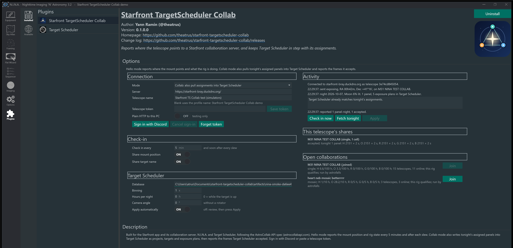

# Starfront TargetScheduler Collab

A N.I.N.A. plugin for [Starfront](https://github.com/bray-sfro/starfront)
collaborations. It reports where your telescope points. It can also pull
tonight's collaboration work into Target Scheduler.

Built for:

- the Starfront app and its collaboration server
- N.I.N.A. 3.2 or later
- Target Scheduler 5 (Collab mode only)
- the [AstroCollab API spec](https://astrocollabapi.com/), protocol 1

## Modes

| Mode | What it does |
|---|---|
| Off | Nothing. |
| Hello | Reports the mount position and rig state. |
| Collab | Hello, plus: pulls tonight's panels into Target Scheduler and reports accepted frames. |

## Install

1. In N.I.N.A., open **Options → General** and add this plugin repository:
   `https://nina-plugins.pulsarfab.com/`
2. Open **Plugins → Available** and install **Starfront TargetScheduler Collab**.
3. Restart N.I.N.A.

To install by hand, unzip a [release](https://github.com/theatrus/starfront-targetscheduler-collab/releases)
into `%LOCALAPPDATA%\NINA\Plugins\3.0.0\Starfront TargetScheduler Collab`.

## Connect

1. Open **Plugins → Installed → Starfront TargetScheduler Collab**.
2. Keep **Server** set to the Starfront server, or enter your own.
3. Click **Sign in with Discord** and approve in the browser.
   Or paste a telescope token and click **Save token**.
4. Pick a **Mode**.

The token is stored in Windows Credential Manager. Each N.I.N.A. profile is
its own telescope.

## Hello mode

The plugin checks in every 5 minutes and soon after each slew. Each check-in
sends:

- the mount position in J2000, with RA in hours
- the state: `slewing`, `exposing`, `parked`, `tracking`, `idle` or `offline`
- the target name, if the last saved frame is within 1° of the mount position
- the telescope name and equipment: focal length, pixel size, sensor, binning
  and filters

Turn off **Share mount position** or **Share target name** to keep them
private. The site location is never sent. On exit, the plugin sends `offline`
with no position. Hello mode never opens the Target Scheduler database.

## Collab mode

Each check-in also:

1. Fetches tonight's assignments.
2. Writes them to Target Scheduler:
   - one project per collaboration, with its minimum altitude
   - one target per assigned panel
   - one exposure plan per panel and filter
3. Reports the frames Target Scheduler accepted, per panel, filter and night.

Review the changes under **Activity**, then click **Apply**. Turn on
**Apply automatically** to skip the review.

### Filters and templates

The server names filters by letter. The plugin matches them to your filter
names:

| Server | Matches |
|---|---|
| L | L, Lum, Luminance, Clear, UV/IR Cut |
| R | R, Red |
| G | G, Green |
| B | B, Blue |
| H | H, Ha, HA, H-alpha, Hydrogen |
| O | O, OIII, O3 |
| S | S, SII, S2, Sulfur |

Matching ignores case, spaces, dashes and a trailing bandpass such as `3nm`.

For each filter, the plugin picks an existing exposure template from the
profile:

1. One whose filter name is a wheel filter, spelled exactly.
2. Then the one with the longest default exposure.

If there is none, it creates one from the wheel filter name, with camera
default gain, offset and readout mode. If no wheel filter matches, that
filter is held, not guessed.

The plugin also tells the server the longest template exposure for each
filter, so work is dealt at that sub length.

### What it changes in Target Scheduler

- It changes only rows it created. It tracks them in `starfront_collab_*`
  tables in the same database.
- It never deletes anything.
- It pauses plans for panels not assigned tonight.
- It keeps frames already taken: tonight's goal is added on top.
- It makes a target inactive, and adds a new one, if a cell moves after
  frames were taken.
- New projects start with the Target Scheduler grader off. Turn it on to
  filter frames before they are reported.

### Reports

- Counts accepted frames. With the grader off, counts frames nobody rejected.
- Sends frame count, integration time, HFR in arcseconds, guide RMS, Moon
  illumination and Moon separation.
- Sends unknown values as unknown.
- Uses the planned cell as the footprint.
- Shows the server's verdict under **Activity**.

### Join and accept

- **Open collaborations** lists open projects. Click **Join** to take a share.
- **This telescope's shares** shows each share and tonight's work. Click
  **Accept** or **Decline** for a share a coordinator offered.

## Limits

- Use one client per telescope. Do not run Collab mode for a telescope that
  another client already reports, such as the Starfront app.
- Target Scheduler decides when to shoot. The plugin decides what.
- Moon avoidance, dithering and flats come from your templates and project
  settings.
- A one-shot color camera without a filter wheel needs an exposure template
  named for the assigned filter.

## Build

See [docs/development.md](docs/development.md).

## License

Apache-2.0. Test fixtures keep their own licenses; see
[tests/StarfrontCollab.Tests/Fixtures/README.md](tests/StarfrontCollab.Tests/Fixtures/README.md).
